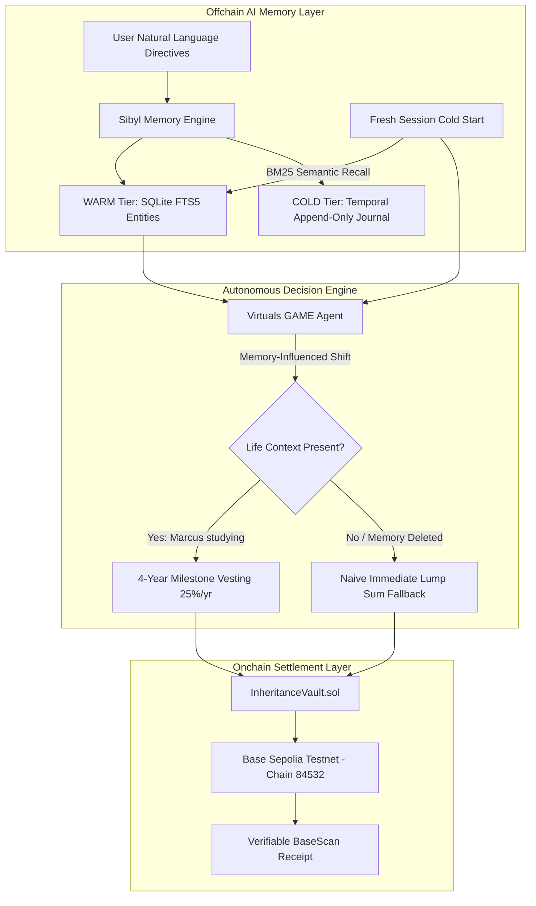

# 🏛️ LegacyFi (InheritanceFi)
> **Autonomous, life-stage inheritance vaults powered by persistent AI memory and Base blockchain settlement.**

Built for the **SIBYL Labs Hackathon 2026** (Multiplier Track: Base + Virtuals Protocol).

[](https://sepolia.basescan.org/address/0x8a92B7436bA88Fe41Ac42e316A74C2361622384a)
[](https://github.com/Cyberpunk738/Legacy-fi)
[](LICENSE)

---

## 📹 Demo Video & Artifacts
- **Official Judge Demo (MP4):** [`recordings/legacyfi-judge-demo.mp4`](recordings/legacyfi-judge-demo.mp4) *(1440×900 HD presentation with visual judge callouts)*
- **WebM Version:** [`recordings/legacyfi-judge-demo-1788782985687.webm`](recordings/legacyfi-judge-demo-1788782985687.webm)
- **Live Local App:** `http://localhost:3000/?view=app`
- **Verified Smart Contract:** [`0x8a92B7436bA88Fe41Ac42e316A74C2361622384a` on BaseScan Sepolia](https://sepolia.basescan.org/address/0x8a92B7436bA88Fe41Ac42e316A74C2361622384a)

---

## 💡 The Core Problem: Dumb Crypto Wills Dump Lump Sums
Traditional crypto inheritance protocols and dead-man switches are rigid:
- They execute **naive 100% token dumps** immediately upon trigger.
- If an estate owner passes away while a child or sibling is in university, dumping a lifetime of savings at once introduces immense financial hazard.
- Standard LLMs cannot solve this because they **forget all family context** once the chat session terminates.

### LegacyFi's Solution: Memory → Decision → Action
LegacyFi pairs **Sibyl's 5-Tier Memory Connectome** (SQLite FTS5 + WARM entities) with **Base Sepolia Smart Contracts**:
1. **Memory:** Remembers qualitative family situations across years and sessions (e.g. *"Marcus is currently studying computer science in college"*).
2. **Decision:** Shifts execution parameters from naive lump-sum transfers into conditional **4-year milestone vesting schedules**.
3. **Action:** Deploys and triggers dedicated Solidity vault contracts on **Base Sepolia** (`84532`).

---

## 🏛️ Architecture Overview



---

## 📋 Hackathon Rule Compliance & Submission Checklist

### 1. Where Memory is Load-Bearing (P0 Gate Litmus Test)
Sibyl Memory is on the critical execution path of LegacyFi. The system behaves completely differently when memory is present versus when it is deleted:

| Phase | User / System Action | Outcome |
| :--- | :--- | :--- |
| **1. Ingest (Write)** | User tells agent: *"Marcus is studying computer science. Release his 30% gradually over 4 years for college tuition."* | Stored in Sibyl WARM entity `[preference:Marcus]` via SQLite FTS5 indexing. |
| **2. Cross-Session Recall** | User hits **"Fresh Session"** (0 tokens context). User asks: *"What did I specify about Marcus?"* | Cold-recalls Marcus's university status directly from Sibyl FTS5 storage. |
| **3. Decision Shift** | System prepares distribution schedule. | **With Memory:** Adapts payout into **4 annual 25% educational tranches**.<br>**Without Memory (Deleted):** Defaults to **naive 100% lump sum**. |
| **4. The Deletion Test** | Delete `[preference:Marcus]` in the Sibyl Inspector. | Agent instantly loses college context and defaults to naive liquidation, proving memory is strictly load-bearing. |

---

### 2. Sibyl Primitives Selected
1. **`Entities & Attributes` (WARM Tier):**
   Structured tracking for beneficiaries (`[preference:Marcus]`, `[preference:Eleanor]`, `[preference:Clara]`), capturing relational roles, educational milestones, and custom directives.
2. **`Full-Text Semantic Recall (FTS5 / BM25)`:**
   Enables instant keyword and semantic query matching across past user sessions to retrieve beneficiary stipulations without vector embedding drift.
3. **`Temporal Journaling & Time-Travel`:**
   Append-only event logs preserving the chronological evolution of estate directives for cryptographic dispute resolution.
4. **`Working Memory Buffer (HOT Tier)`:**
   Coordinates active session prompts with live Base wallet and smart contract states.

---

### 3. Multiplier Tracks & Partner Integrations
* 🔵 **Base Network (Ethereum L2)**:
  * **Contract Source:** [`contracts/src/InheritanceVault.sol`](contracts/src/InheritanceVault.sol)
  * **Verified Deployment:** [`0x8a92B7436bA88Fe41Ac42e316A74C2361622384a`](https://sepolia.basescan.org/address/0x8a92B7436bA88Fe41Ac42e316A74C2361622384a) on Base Sepolia (`84532`).
  * **Client Integration:** [`lib/base/contractClient.ts`](lib/base/contractClient.ts) supports live MetaMask/Coinbase wallet signing, on-demand contract deployment, and deposit execution.
* 🤖 **Virtuals Protocol GAME Track**:
  * **Agent Tools:** `save_memory`, `search_memory`, `get_inheritance_plan`, `update_inheritance_plan`, `prepare_distribution` defined in [`lib/agent/virtualsAgent.ts`](lib/agent/virtualsAgent.ts).
  * **Chat API:** [`app/api/chat/route.ts`](app/api/chat/route.ts).

---

## 🚀 Quick Start & Local Execution

### Prerequisites
* [Node.js](https://nodejs.org/) version 18 or higher.
* Web browser (Chrome, Edge, Firefox, Brave).

### 1. Install Dependencies
```bash
npm install
```

### 2. Start Local Development Server
```bash
npm run dev
```
Open **[http://localhost:3000/?view=app](http://localhost:3000/?view=app)** in your browser.

### 3. Run Automated Judge Demo Recording (Playwright + MP4)
```bash
# Runs full automated judge walkthrough and generates recordings/legacyfi-judge-demo.mp4:
npm run record:demo

# Or convert existing recordings to MP4:
npm run record:mp4
```

---

## 🎯 Key Application Views

1. **Estate Studio (`DashboardView.tsx`)**:
   - Status cards for **Active Sibyl Entities**, **Base Sepolia Connectivity**, and **Allocation %**.
   - **Load-Bearing A/B Toggle:** Live toggle between `[● With Sibyl Memory]` and `[○ Without Memory (Deleted)]` displaying real-time contract payload changes.
   - **Base Vault Deployment:** 1-click onchain deployment of dedicated Solidity vault contracts.
2. **Family Assistant (`AgentChatView.tsx`)**:
   - Natural language dialogue with **Fresh Session** reset button to verify cross-session recall.
3. **Sibyl Inspector (`MemoryInspectorView.tsx`)**:
   - Visual connectome of all 5 memory tiers (HOT, WARM, COLD, REFERENCE, ARCHIVE) with search and deletion controls.
4. **Vault Settlement (`VaultExecutionView.tsx`)**:
   - Dead-man switch simulation and Base Sepolia multi-tranche execution with verified BaseScan receipts.

---

## 📜 License
MIT License. Created for the SIBYL Labs Hackathon 2026.
